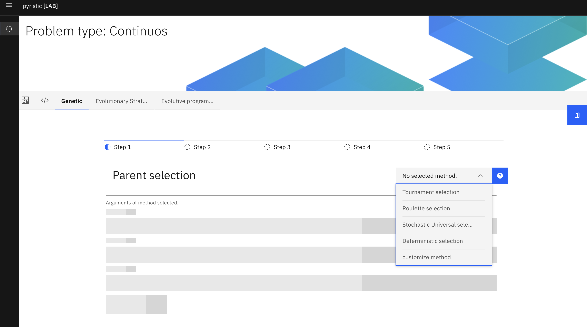

# ¡¡Welcome to pyristic Lab!!

This project has been developed to make easiest to work with pyristic python library (if python is friendly, this is too friendly).
It depends on the pyristicAPI project, so this project doesn't work or not has any interesting if you dont execute both projects. Also, you don't have to worry about dependencies or the OS, because it was created to use it in containers.

## How to execute
This project has a docker-compose file, it orchestate the API and the front end. The following command should be executed:
- `docker compose up`

The command mentioned above pull the current available image of the pyristicAPI and the front end image. After that, you will see both services up. If everything works, you could see the UI typing in your browser **http://localhost:3000/** as in the image below. Enjoy solving optimization problems!!!

If you want to remove the containers related to the project, execute the following:
- `docker compose down`

## Current structure
TODO

## Note
This project is currently in progress, you can find some bugs, but you can contribute :)
